# SignBridge - System Diagrams

This document contains visual representations of SignBridge's architecture, data flows, and component interactions.

---

## System Architecture Overview

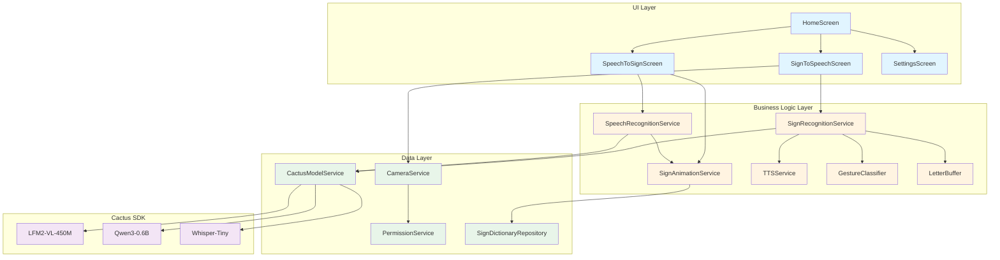

---

## Sign-to-Speech Data Flow

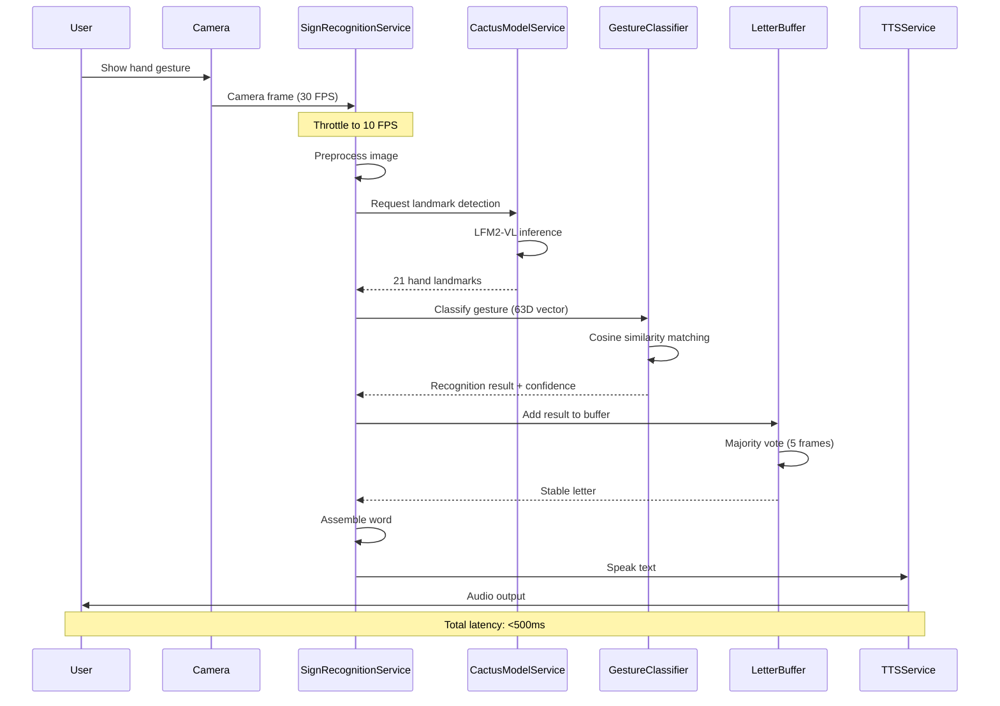

---

## Speech-to-Sign Data Flow

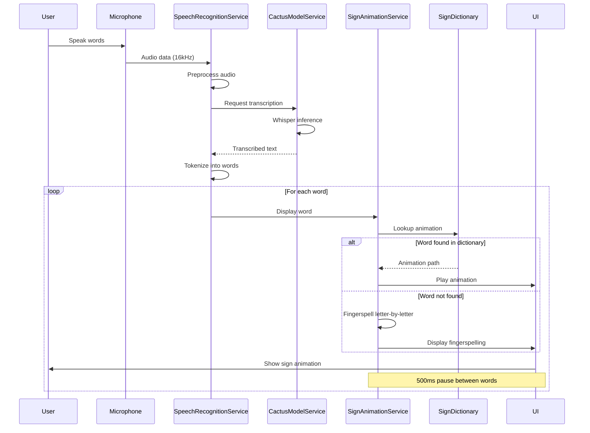

---

## Component Interaction Diagram

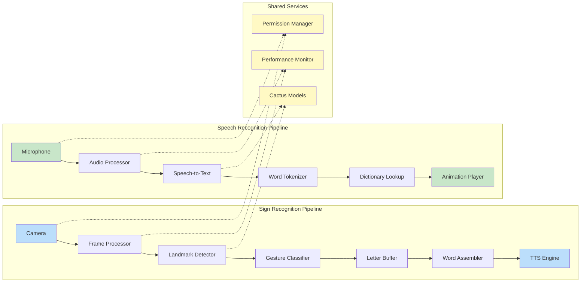

---

## State Management Flow

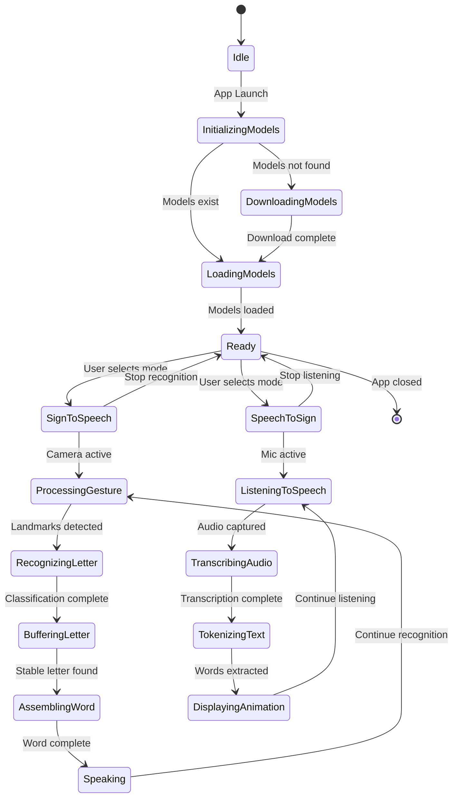

---

## Performance Optimization Strategy

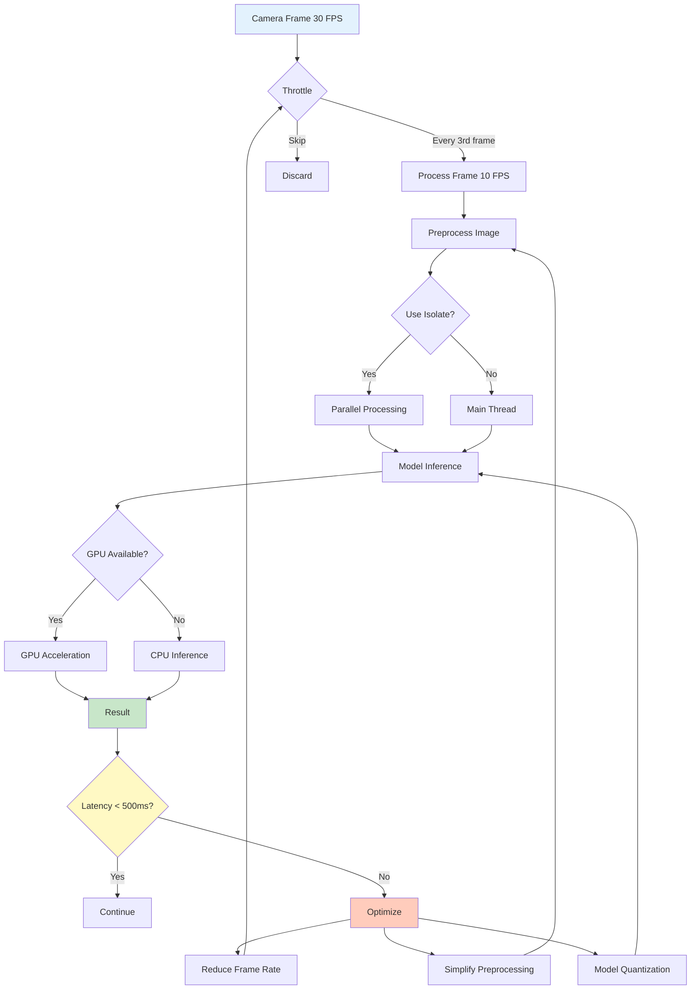

---

## Error Handling Flow

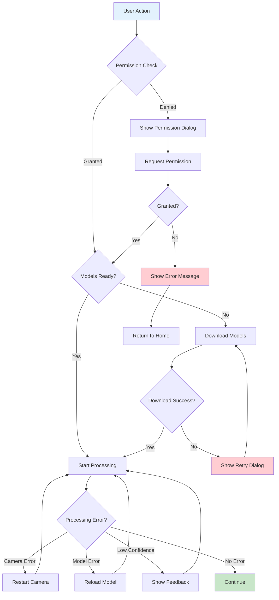

---

## Memory Management Strategy

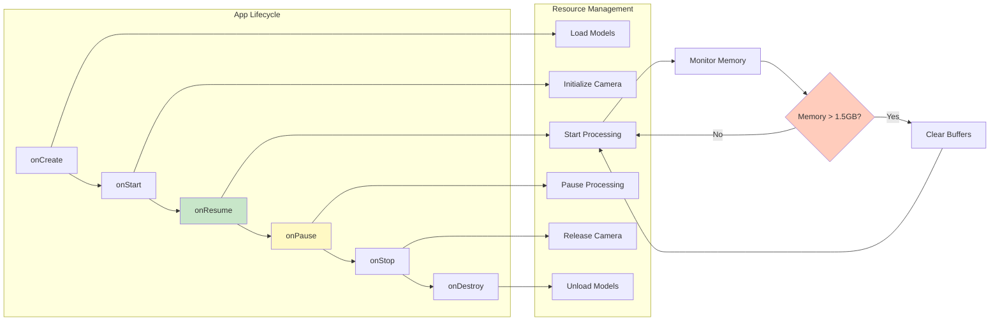

---

## Deployment Architecture

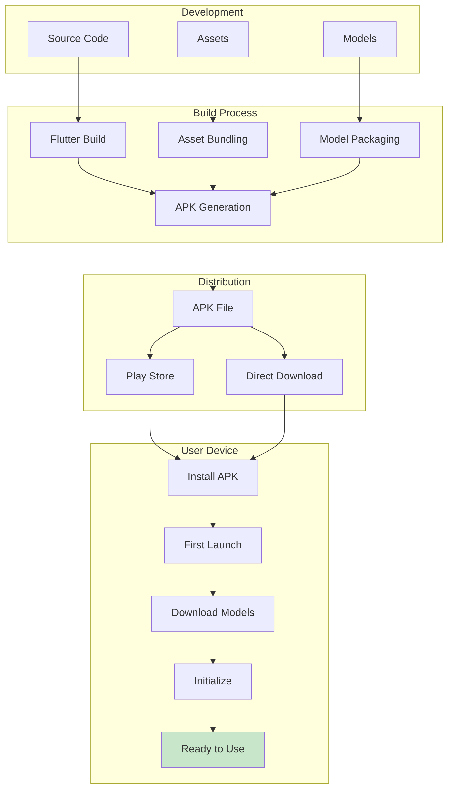

---

## Testing Strategy

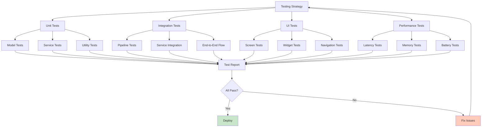

---

## Key Metrics Dashboard

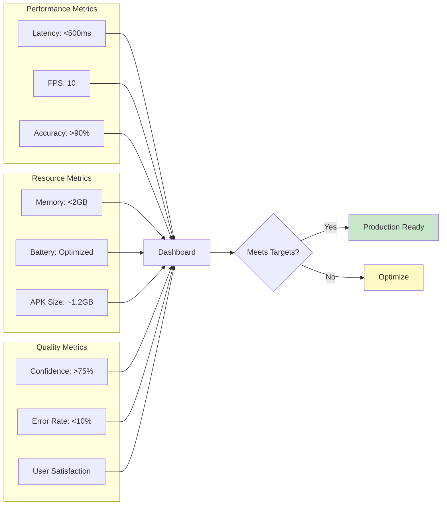

---

## Future Enhancements Roadmap

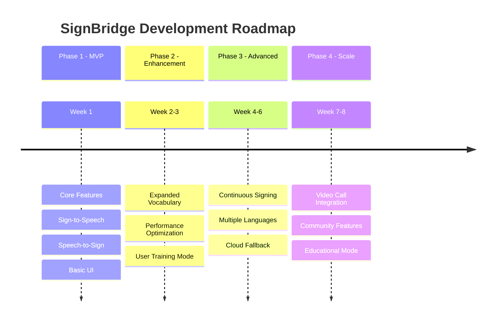

---

## Security & Privacy Architecture

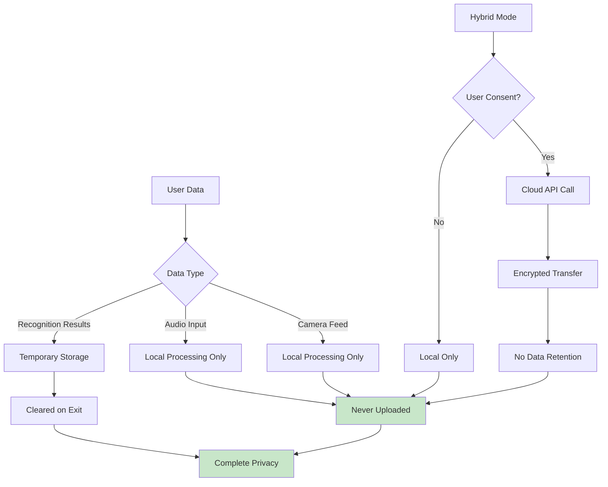

---

These diagrams provide a comprehensive visual understanding of SignBridge's architecture, data flows, and system interactions. Use them as reference during implementation and for documentation purposes.